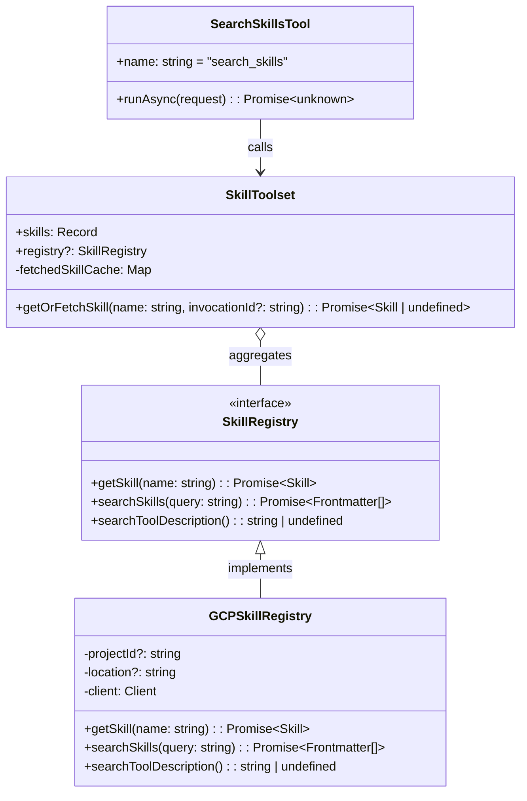

# Skills Registry Implementation Plan (adk-js)

This document provides an in-depth implementation plan and architectural blueprint for introducing the **Skills Registry** into `adk-js`. It draws direct inspiration from the existing implementation in `adk-python` to ensure strict parity, robust architectural alignment, and idiomatic TypeScript design.

---

## 1. Executive Summary & Parity Analysis

### Is Skills Registry Implemented in `adk-python`?

**Yes.** `adk-python` features a fully fleshed-out skill registry subsystem comprising:

1. **Core Abstraction (`SkillRegistry`)**: Defined in `src/google/adk/skills/skill_registry.py`, establishing an abstract base class for fetching skills by name and querying/discovering skills via semantic search.
2. **GCP Integration (`GCPSkillRegistry`)**: Defined in `src/google/adk/integrations/skill_registry/gcp_skill_registry.py`, leveraging the Vertex AI client (`v1beta1`) to fetch zipped skill filesystems, extract base64 archives in memory, and parse `SKILL.md` along with L3 resources (assets, references, scripts).
3. **Tool & Toolset Support**: `SkillToolset` manages dynamic fallback to the registry when local skills are requested but not found, caching fetched definitions per agent turn. It also registers a dedicated `SearchSkillsTool`.

### Current State of `adk-js`

`adk-js` implements static local skills (`SkillToolset`, `LoadSkillTool`, `LoadSkillResourceTool`, `RunSkillScriptTool`, etc.) in `core/src/tools/skill/`, but currently lacks:

- The abstract `SkillRegistry` interface.
- A remote GCP/Vertex implementation (`GCPSkillRegistry`).
- Dynamic skill searching (`SearchSkillsTool`).
- Turn-based or invocation-based caching and remote fetch fallback within `SkillToolset`.

---

## 2. Architectural Blueprint for `adk-js`



---

## 3. Step-by-Step Implementation Roadmap

### Step 1: Define Core Interface (`core/src/skills/skill_registry.ts`)

Create the baseline interface contract that any registry must satisfy:

```typescript
/**
 * @license
 * Copyright 2026 Google LLC
 * SPDX-License-Identifier: Apache-2.0
 */

import {Frontmatter, Skill} from './skill.js';

/**
 * Interface for a skill registry.
 */
export interface SkillRegistry {
  /**
   * Fetches a skill from the registry.
   *
   * @param name The name of the skill.
   * @returns A Promise resolving to a Skill object.
   */
  getSkill(name: string): Promise<Skill>;

  /**
   * Searches for skills in the registry.
   *
   * @param query The search query.
   * @returns A Promise resolving to a list of Frontmatter objects for discovery.
   */
  searchSkills(query: string): Promise<Frontmatter[]>;

  /**
   * Returns the description for the search_skills tool.
   */
  searchToolDescription?(): string | undefined;
}
```

---

### Step 2: Implement `SearchSkillsTool` (`core/src/tools/skill/search_skills_tool.ts`)

Add a dedicated GenAI tool enabling the model to search remote skills dynamically:

```typescript
/**
 * @license
 * Copyright 2026 Google LLC
 * SPDX-License-Identifier: Apache-2.0
 */

import {FunctionDeclaration, Type} from '@google/genai';
import {experimental} from '../../utils/experimental.js';
import {BaseTool, RunAsyncToolRequest} from '../base_tool.js';
import {SkillToolset} from './skill_toolset.js';
import {getLogger} from '../../utils/logger.js';

const logger = getLogger();

@experimental
export class SearchSkillsTool extends BaseTool {
  constructor(private toolset: SkillToolset) {
    if (!toolset.registry) {
      throw new Error('SearchSkillsTool requires a configured skill registry.');
    }
    super({
      name: 'search_skills',
      description:
        toolset.registry.searchToolDescription?.() ||
        'Searches for relevant skills in the registry based on a semantic or keyword query.',
    });
  }

  override _getDeclaration(): FunctionDeclaration {
    return {
      name: this.name,
      description: this.description,
      parameters: {
        type: Type.OBJECT,
        properties: {
          query: {
            type: Type.STRING,
            description: 'Semantic or keyword search query.',
          },
        },
        required: ['query'],
      },
    };
  }

  override async runAsync({args}: RunAsyncToolRequest): Promise<unknown> {
    const query = args['query'] as string;
    if (!query) {
      return {
        error: "Argument 'query' is required.",
        error_code: 'INVALID_ARGUMENTS',
      };
    }

    try {
      const results = await this.toolset.registry!.searchSkills(query);
      return results.filter((r) => {
        if (this.toolset.skills[r.name]) {
          logger.warn(
            `Skill naming conflict: skill '${r.name}' already exists locally. Registry skill is filtered.`,
          );
          return false;
        }
        return true;
      });
    } catch (e: any) {
      return {
        error: `Failed to search skills from registry: ${e.message || e}`,
        error_code: 'REGISTRY_ERROR',
      };
    }
  }
}
```

---

### Step 3: Upgrade `SkillToolset`, `LoadSkillTool`, and `LoadSkillResourceTool`

Refactor `SkillToolset` to take an optional `registry` instance, manage `fetchedSkillCache`, and inject instructions.

```typescript
// Add to SkillToolset options
export class SkillToolset extends BaseToolset {
  public registry?: SkillRegistry;
  private fetchedSkillCache = new Map<string, Map<string, Skill>>();
  // ...

  async getOrFetchSkill(
    name: string,
    invocationId?: string,
  ): Promise<Skill | undefined> {
    if (this.skills[name]) {
      return this.skills[name];
    }
    if (!this.registry) {
      return undefined;
    }

    const contextKey = invocationId || 'default';
    if (!this.fetchedSkillCache.has(contextKey)) {
      this.fetchedSkillCache.set(contextKey, new Map());
    }

    const cache = this.fetchedSkillCache.get(contextKey)!;
    if (cache.has(name)) {
      return cache.get(name)!;
    }

    const skill = await this.registry.getSkill(name);
    cache.set(name, skill);
    return skill;
  }
}
```

Update `LoadSkillTool` to use `await this.toolset.getOrFetchSkill(skillName, toolContext.invocationId)` instead of synchronous `this.toolset.getSkill(skillName)`. Repeat this pattern for `LoadSkillResourceTool` and `RunSkillScriptTool`.

---

### Step 4: Implement `GCPSkillRegistry` (`core/src/skills/gcp_skill_registry.ts`)

Implement the Vertex AI API connection to fetch zipped filesystems and parse `SKILL.md` using `jszip` (or similar node zip utility).

```typescript
/**
 * @license
 * Copyright 2026 Google LLC
 * SPDX-License-Identifier: Apache-2.0
 */

import {Client} from '@google-cloud/vertexai/build/src/genai/client.js';
import {SkillRegistry} from './skill_registry.js';
import {Frontmatter, Skill, FrontmatterSchema} from './skill.js';
import {experimental} from '../utils/experimental.js';
// Depending on standard dependencies, import JSZip / zip parsing utils

export interface GCPSkillRegistryOptions {
  projectId?: string;
  location?: string;
}

@experimental
export class GCPSkillRegistry implements SkillRegistry {
  private projectId?: string;
  private location?: string;
  private client: Client;

  constructor(options: GCPSkillRegistryOptions = {}) {
    this.projectId = options.projectId || process.env.GOOGLE_CLOUD_PROJECT;
    this.location = options.location || process.env.GOOGLE_CLOUD_LOCATION;
    this.client = new Client({
      project: this.projectId,
      location: this.location,
    });
  }

  async getSkill(name: string): Promise<Skill> {
    const fullName = `projects/${this.projectId}/locations/${this.location}/skills/${name}`;
    // Query Vertex internal API client or use REST fetch to retrieve skill resource
    // Base64 decode the zippedFilesystem property
    // Unpack ZIP in memory and parse SKILL.md frontmatter & instructions
  }

  async searchSkills(query: string): Promise<Frontmatter[]> {
    // Query client.skills.retrieve({query})
    // Parse response items into Frontmatter[]
  }
}
```

---

## 4. Finalized Design Decisions

Based on user alignment, the following implementation choices have been finalized:

1. **ZIP Extraction Library**: Since no zip library is currently imported in `core/package.json` or `dev/package.json`, `adm-zip` will be added to `core/package.json`. It provides excellent buffer-based in-memory zip unpacking in Node.js, closely matching Python's `zipfile` semantics.
2. **Internal Client Wrappers**: The implementation will leverage `@google-cloud/vertexai` internal API structures (such as `ApiClient` / `BaseModule` / `Client`) to invoke `skills.get` and `skills.retrieve` endpoints, maximizing re-use of internal SDK auth, headers, and request options.
