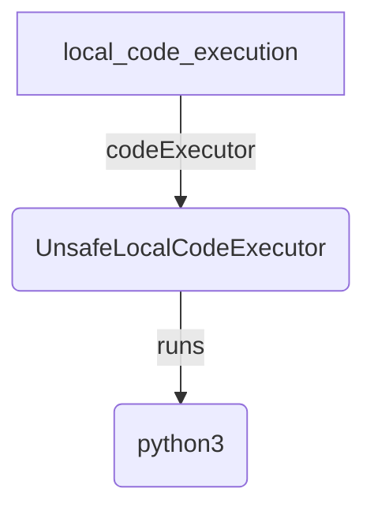

# Local code execution

## Overview

An agent that answers questions by writing Python and running it on this
machine. The model writes a fenced code block, `UnsafeLocalCodeExecutor` runs it
with `python3`, and the model reads the printed output before it answers. Any
file the code writes into its working directory is saved as an artifact.

The executor has no sandbox: the model's code runs as the current user, with
full access to the file system and the network. Run the sample only where that
is acceptable.

## Sample Inputs

- `what is the 50th Fibonacci number?`

- `how many prime numbers are there below 100,000?`

- `write the first ten square numbers to squares.csv`

  _The code writes `squares.csv` into its working directory. The result event
  lists it under `Saved artifacts`, and it appears in the artifact panel of
  `adk web`._

## Graph



The executor is not a tool. It does not appear in the tool list, and the model
never calls it by name.

## How To

**Give the agent a code executor.** `codeExecutor` is a field on `LlmAgent`, not
an entry in `tools`.

```ts
export const rootAgent = new LlmAgent({
  name: 'local_code_execution',
  model: 'gemini-flash-latest',
  codeExecutor: new UnsafeLocalCodeExecutor({timeoutSeconds: 30}),
});
```

**Ask for Python in a fenced block.** After each model response, the agent looks
for the first block that opens with one of the executor's
`codeBlockDelimiters`, such as ` ```python `, runs it, and sends the output
back as a ` ```tool_output ` block. Every block the agent executes is run as
Python, whatever its fence says, so the instruction asks for Python only.

**Print what the model needs to see.** Only standard output and standard error
come back. A value that is computed and not printed is invisible to the model.

**Write files to the working directory.** Each run gets a fresh temporary
directory, and every file left in it after the run, other than the script, is
saved as an artifact under its relative path. The directory is deleted after
the run, so variables and files do not carry over from one block to the next.

## How To Run

Requires an API key, because the agent calls a live model, and `python3` on the
`PATH`.

```bash
export GEMINI_API_KEY=...
npm run build
npm run sample -- samples/code_execution/local_code_execution/agent.ts
```

`samples/` is not an npm workspace, so `npm run build` does not type-check it.
Check the sample on its own after editing it:

```bash
npm run ts:check:samples
```

To see the executable code, the execution result and the saved artifact as
separate events, run the category under `adk web` instead:

```bash
node dev/dist/esm/cli_entrypoint.js web samples/code_execution
```

## Related Guides

- [Code executors](../../../docs/guides/code_executors/index.md) - How an agent runs model-written code, and how to choose between the executors.
