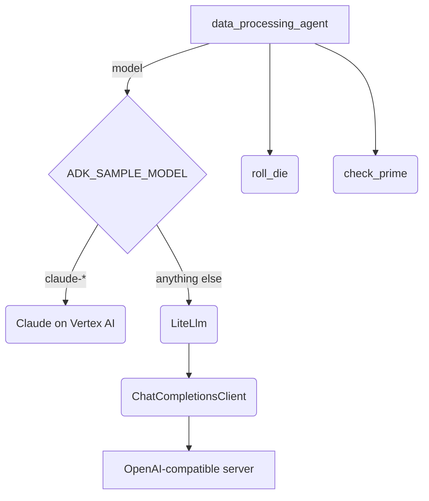

# Model samples

## Overview

One agent that runs on a model other than Gemini. The agent, its instruction
and its two tools are adk-python's `hello_world_litellm` sample: `roll_die`
rolls a die, and `check_prime` reports which numbers in a list are prime. Only
the `BaseLlm` instance passed as `model` changes:

- `LiteLlm`, the default, sends the request to any server that speaks the
  OpenAI chat-completions protocol, through `ChatCompletionsClient` in
  `chat_completions_client.ts`. `LiteLlm` bundles no client, so the sample
  ships a complete one built on `fetch`, including streaming.
- `Claude` sends it to Claude on Vertex AI. Set `ADK_SAMPLE_MODEL` to a name
  starting with `claude-` to use it.

## Running

Build once, then run the sample by its `agent.ts` path:

```bash
npm run build            # builds @google/adk (and the CLI); needed once / after changes
npm run sample -- samples/models/agent.ts
```

`samples/` is not an npm workspace, so `npm run build` does not compile it. It
has its own `samples/tsconfig.json` and is type-checked separately, in CI and
locally:

```bash
npm run ts:check:samples
```

The sample also runs in the `adk web` dev UI, from the repository root, where
it appears as the `models` app:

```bash
node dev/dist/esm/cli_entrypoint.js web samples
```

## Requirements

The sample calls a live model, and which variables it reads depends on the
model class.

**`LiteLlm`.** With no variables set, the client posts to a LiteLLM proxy on
its default address, `http://localhost:4000`, and asks for `gpt-4o`:

```bash
litellm --model gpt-4o
npm run sample -- samples/models/agent.ts
```

| Variable                    | Default                 | Meaning                                                    |
| --------------------------- | ----------------------- | ---------------------------------------------------------- |
| `ADK_SAMPLE_MODEL`          | `gpt-4o`                | The model name sent to the server.                         |
| `CHAT_COMPLETIONS_BASE_URL` | `http://localhost:4000` | The server; the client posts to `<base>/chat/completions`. |
| `CHAT_COMPLETIONS_API_KEY`  | unset                   | Sent as `Authorization: Bearer <key>` when set.            |

To call OpenAI directly instead:

```bash
export CHAT_COMPLETIONS_BASE_URL=https://api.openai.com/v1
export CHAT_COMPLETIONS_API_KEY=...
npm run sample -- samples/models/agent.ts
```

**`Claude`.** Set `GOOGLE_CLOUD_PROJECT` and `GOOGLE_CLOUD_LOCATION`, configure
application default credentials, and enable the Claude model in that project
and region:

```bash
export ADK_SAMPLE_MODEL=claude-3-5-sonnet-v2@20241022
npm run sample -- samples/models/agent.ts
```

## Sample inputs

- `roll a 12-sided die and check whether the result is prime`

  The model calls `roll_die` with `sides: 12`, then `check_prime` with the
  result, then answers with both.

- `roll a 6-sided die twice`

  With `LiteLlm` the model may request both rolls in one turn. With `Claude`
  it makes them one turn at a time, because `Claude` disables parallel tool
  use.

## Graph



## How to

**Pass a model instance, not a name.** Neither class is registered in
`LLMRegistry`, so `model: 'gpt-4o'` would throw `Model gpt-4o not found.`

```ts
new LiteLlm({
  model,
  llmClient: new ChatCompletionsClient(baseUrl, apiKey),
});
```

**Keep the transport in the client.** `LiteLlm` hands the client a
`CompletionRequest` that is already in chat-completions form. The client only
sends it, merging `additionalArgs` into the body, and returns the parsed
response, or for a streaming request one parsed chunk per server-sent event.

**Mark every streamed tool-call delta as a function.** OpenAI sends
`type: 'function'` on the first delta of a streamed tool call only, and
`LiteLlm` reads tool calls by that type, so the client fills it in on every
delta.

## Worth knowing

- **`Claude` does not stream.** It yields one complete response even when the
  run asks for streaming, and it caps replies at 1,024 tokens.
- **`LiteLlm` streams one tool call at a time.** On the streaming path, two
  tool calls in one turn are concatenated into one. The CLI does not stream;
  `adk web` does when its streaming toggle is on.
- **The tool schema differs by class.** `LiteLlm` sends lower-case JSON Schema
  types at every level plus the `required` list. `Claude` lower-cases only the
  top-level property types and sends no `required` list.

## See also

- [Models guide](../../docs/guides/models/index.md) - What each class converts, how to write a `LiteLlmClient`, the streaming behavior, and the limitations.
- [Tool samples](../tools/README.md) - The other agent sample category.
