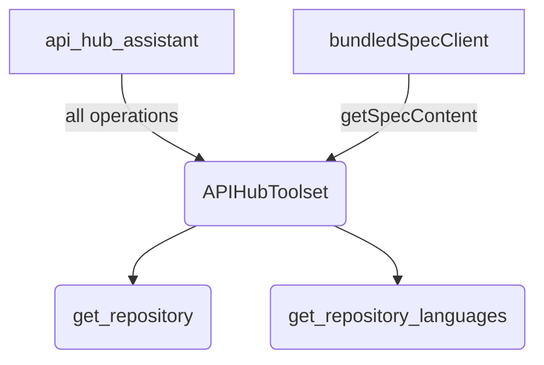

# API Hub tool

## Overview

`APIHubToolset` resolves a Google Cloud API Hub resource name to one OpenAPI
specification and gives an agent one tool per operation in it. This sample runs
that whole path against the public GitHub REST API: a resource name goes in, and
`api_hub_assistant` comes out holding `get_repository` and
`get_repository_languages`.

A live API Hub read needs a Cloud project, a catalogued API and credentials.
The sample substitutes its own `BaseAPIHubClient`, which returns the bundled
`github_spec.yaml`, so the catalogue is the only part that is stubbed. The
toolset, the generated tools and the HTTP calls are real, and the only key the
sample needs is the one for the model.

Build the package, verify the sample types, and run the agent from the repository root:

```bash
npm run build
npm run ts:check:samples
GEMINI_API_KEY="your-key" npm run sample -- samples/tools/apihub_tool/agent.ts
```

## Sample Inputs

- `how many stars does googleapis/js-genai have?`

  The agent calls `get_repository`, which is
  `GET https://api.github.com/repos/googleapis/js-genai`. It reports the
  `stargazers_count` the response carries.

- `what languages is google/adk-python written in?`

  The agent calls `get_repository_languages`, which is
  `GET https://api.github.com/repos/google/adk-python/languages`. The response
  is bytes of code per language.

- `compare the open issue counts of google/adk-python and googleapis/js-genai`

  Two calls to `get_repository`, one per repository. Both tools come from the
  one specification the toolset resolved.

## Graph



## How To

**Name the resource, and hand the toolset to an agent.** A `BaseToolset` goes
into `tools` whole, and the agent sees one function declaration per operation in
the specification.

```ts
const githubToolset = new APIHubToolset({
  apihubResourceName:
    'projects/sample-project/locations/us-central1/apis/github-repositories',
  apihubClient: bundledSpecClient,
});
```

**Substitute the client to run without API Hub.** `BaseAPIHubClient` declares
one method, so an object literal satisfies it. The same option takes a test
double, a file on disk, or a private catalogue.

```ts
const bundledSpecClient: BaseAPIHubClient = {
  getSpecContent: async () => GITHUB_SPEC,
};
```

`apihubResourceName` stays required with a substituted client, because the
client decides what to do with it. The one above ignores it.

**Point the sample at a real API Hub resource.** Drop the `apihubClient` option
and give the toolset a credential. The toolset then builds an `APIHubClient` of
its own:

```ts
const githubToolset = new APIHubToolset({
  apihubResourceName: 'projects/my-project/locations/us-central1/apis/my-api',
  accessToken: process.env.APIHUB_ACCESS_TOKEN,
});
```

`gcloud auth print-access-token` prints a token that works for about an hour.
Omit `accessToken` as well to use Application Default Credentials, which is what
a Cloud Run service or a machine running `gcloud auth application-default login`
already has.

**Read the specification from a file, not from a string literal.** A caller is
handed a document; the fixture sits beside the agent for the same reason.

```ts
const GITHUB_SPEC = readFileSync(
  join(dirname(fileURLToPath(import.meta.url)), 'github_spec.yaml'),
  'utf8',
);
```

**A failing call is a result, not an exception.** `RestApiTool` returns the
response body whatever the status is, so a non-2xx answer reaches the model as
the API's own error payload. GitHub rate-limits unauthenticated callers, and
that is the path a burst of prompts takes: the model receives GitHub's
`{"message": "API rate limit exceeded …"}`. The instruction tells the agent to
report the error rather than invent an answer.

## Related Guides

- [API Hub tool](../../../docs/guides/tools/apihub_tool/index.md) - Turning a catalogued API into tools: the resource name, the credential, and substituting the client.
